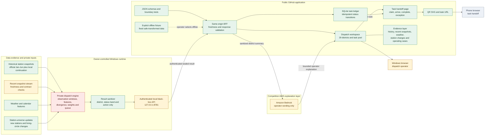

# Architecture And Delivery Boundary

## Competition Runtime

The public application exposes the complete operating workflow. The private engine supplies only contract-bound results and does not send formulas, weights, exact scores or source databases to the browser.

## Dispatch Vehicle Policy

| Vehicle | Operational role | When selected | Explicit limit |
| --- | --- | --- | --- |
| Motorcycle | Fast field verification, station condition check and task handoff | A location needs quick confirmation before committing a larger crew | Does not transport bicycles |
| Truck | Physical redistribution of bicycles | The approved task requires adding or removing multiple bicycles | Requires a confirmed loading target and handoff task |

The private engine recommends a response class. The public task workflow records assignment and completion; it does not expose the scoring formula.

## Evidence-To-Action Cases

| Evidence | Operational reading | Evidence-supported response | Claim boundary |
| --- | --- | --- | --- |
| Rain, heat and holiday bicycle-lane periods | Borrow and return duration can lengthen while turnover falls | Extend the observation window and prepare reserve bicycles | An observed association, not proof of a single cause |
| Historical baseline versus recent snapshot drift | A district is moving away from its normal time pattern | Adjust the regional task queue and response class | Public output shows direction and bands, not the private score |
| Rapid station growth after urban development | The previous station baseline no longer represents the new living circle | Update the station universe before recalculating district balance | New stations enter through a versioned update gate |
| Jing'an transfer-area imbalance | Peak pressure may persist after ordinary redistribution | Compare electric-assist bicycle allocation with off-peak redistribution | A testable operating scenario, not an announced official policy |
| Tourism and school calendar cycles | Holiday and term-time patterns differ from ordinary commute periods | Compare against the matching seasonal baseline before changing the task queue | The public package shows bands and direction, not causal weights |
| Rivers, bridges and major-road barriers | Straight-line neighbours may not belong to the same reachable operating area | Prefer same-side living-circle balancing before cross-barrier movement | A reachability guard, not a claim of globally optimal routing |
| Long-holiday field execution | Stranded or pending-replenishment bicycles need confirmation before bulk movement | Motorcycle first-response, then one-direction off-peak truck allocation | The motorcycle verifies and hands off; it does not carry bicycles |

## Page And Workspace Index

The executable page, API and evidence ownership table is maintained in [PAGE_AND_WORKSPACE_INDEX.md](PAGE_AND_WORKSPACE_INDEX.md).

## Modes

| Mode | Result source | Task and QR workflow | Claim |
| --- | --- | --- | --- |
| `LIVE_LOCAL_SANDBOX` | Owner-controlled Windows black-box API | Fully operational | Near-real-time only when source freshness and result contract both pass |
| `SEALED_DEMO_FIXTURE` | Explicit safe-transformed fixed fixture | Fully operational | Offline demonstration only |
| `PORTABLE_SEALED_FALLBACK` | Owner-provided sealed package | Fully operational | Fixed-time fallback, never realtime |
| `AWS_EXPLANATION` | Sanitized district summary | Does not create or change dispatch decisions | Explanation layer only |

## Data Publication Semantics

| Layer | Public meaning | Not claimed |
| --- | --- | --- |
| Historical coverage | 2026-01 through 2026-09-11; intervalized and time-shifted district-group trends | Not a raw database, current inventory, station-level reconstruction, or exact ratio series |
| Dated compact snapshot | 2026-09-08 19:16 through 2026-09-11 01:38, 313 batches and 500,824 rows over a 1,606-station dimension | Completeness does not extend beyond that batch |
| Weather and calendar evidence | Historical comparison of conditions and time periods | Not proof that weather alone caused a dispatch outcome |
| Live black-box result | Near-real-time only when source timestamp, freshness, and schema validation pass | A healthy connection alone does not prove fresh data |
| Safe-transformed fixed fixture | Operator-selected workflow demonstration | Never presented as a calculated or current result |

## Trust Boundaries

1. The browser calls only the public same-origin BFF and task API.
2. The black-box bearer token remains in a file outside this repository.
3. The private API is loopback-only on the venue computer.
4. The task database is created outside this repository.
5. Bedrock receives district aliases, bands, small counts, reason tags and policy flags only.
6. Bedrock failure does not stop local dispatch, task creation or QR actions.
7. Offline data is selected explicitly and is never an automatic fallback.
8. An unrelated submitted project, its repository and its AWS profile are never reused by this project.
