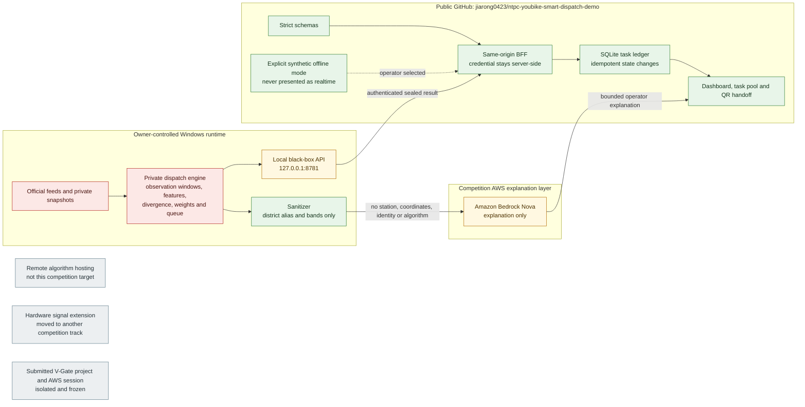

# Architecture And Delivery Boundary

## Competition Runtime

## Modes

| Mode | Result source | Task and QR workflow | Claim |
| --- | --- | --- | --- |
| <code>LIVE_LOCAL_SANDBOX</code> | Owner-controlled Windows black-box API | Fully operational | Near-real-time only when source freshness and result contract both pass |
| <code>SEALED_DEMO_FIXTURE</code> | Explicit safe-transformed fixed fixture | Fully operational | Offline demonstration only |
| <code>PORTABLE_SEALED_FALLBACK</code> | Owner-provided sealed package | Fully operational | Fixed-time fallback, never realtime |
| <code>AWS_EXPLANATION</code> | Sanitized district summary | Does not create or change dispatch decisions | Explanation layer only |

## Data Publication Semantics

| Layer | Public meaning | Not claimed |
| --- | --- | --- |
| Historical coverage | 2026-01 through 2026-09-11; intervalized and time-shifted district-group trends | Not a raw database, current inventory, station-level reconstruction, or exact ratio series |
| Dated compact snapshot | 2026-09-08 19:16 through 2026-09-11 01:38, 313 batches and 500,824 rows over a 1,606-station dimension | Completeness does not extend beyond that batch |
| Weather baseline | 2026-08-03 through 2026-08-14 historical comparison | Not September realtime weather |
| Live black-box result | Near-real-time only when source timestamp, freshness, and schema validation pass | A healthy connection alone does not prove fresh data |
| Safe-transformed fixed fixture | Operator-selected workflow demonstration | Never presented as a calculated or current result |

## Trust Boundaries

1. The browser calls only the public same-origin BFF and task API.
2. The black-box bearer token remains in a file outside this repository.
3. The private API is loopback-only on the venue computer.
4. The task database is created outside this repository.
5. Bedrock receives district aliases, bands, small counts, reason tags and policy flags only.
6. Bedrock failure does not stop local dispatch, task creation or QR actions.
7. Offline data is selected explicitly and is never an automatic fallback.
8. The unrelated submitted project, its repository and its AWS profile are never reused by this project.
