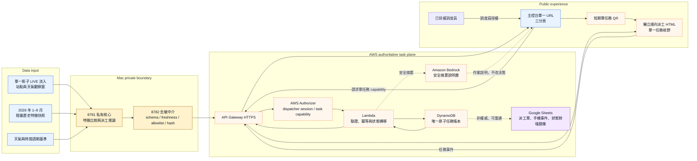

# LIVE Architecture And Delivery Boundary

## Locked Current Architecture

Current critical path 是：

`Mac 單一影子 LIVE 流入 → 8781 → 8782 → API Gateway → Lambda → DynamoDB → 前端／手機`。

Google Sheets 位於 DynamoDB 之後，只做對帳鏡像。Current 只有 Mac LIVE 主線，不存在第二套執行模式。

## Layer Responsibilities

| Layer | Responsibility | Forbidden responsibility |
| --- | --- | --- |
| 單一影子 LIVE 流入 | 收集近期站點與天氣，維持一個 current 觀察窗 | 同時啟動第二條原始收集線 |
| 1–9 月輕量基準 | 提供時間週期、區域與天氣特徵比較 | 提供前端逐站原始歷史列 |
| `8781` 私有核心 | 比較特徵、產生優先級與派工候選 | 對外公開公式、權重、分數或原始資料 |
| `8782` 去敏中介 | 驗 schema、新鮮度、hash、欄位白名單並重建安全 payload | 讓未知欄位或任意黑箱文字直接穿透 |
| API Gateway | 提供固定 HTTPS 邊界與路由 | 持有核心演算法或瀏覽器憑證 |
| AWS Authorizer | 區分調度員 session 與短期單任務 capability | 讓手機 capability 取得主控台權限 |
| Lambda | 驗證請求、執行冪等狀態轉移與授權 | 以 Google Sheets 作競態控制 |
| DynamoDB | 任務、事件及狀態的唯一原子權威 | 依賴 Sheet 寫入成功才提交狀態 |
| Google Sheets | 顯示派工單、手機事件及 DynamoDB 對帳結果 | 成為原子狀態權威或回寫推翻 DynamoDB |
| 調度員主控台 | 單一 URL 內的區域態勢、派工任務、證據對帳三分頁 | 對未授權使用者或手機 capability 開放 |
| 順向派工 HTML | 顯示單一任務並提交完成／異常事件 | 連回主控台、列舉其他任務或顯示黑箱／AWS 資訊 |
| Bedrock | 將安全摘要改寫為現場作業說明 | 參與優先級、車種或任務決策 |

## Data Publication Contract

8782 之後只允許結果導向欄位，例如：

- contract、publication 與 schema 版本。
- 結果產生時間、來源快照時間、天氣基準時間及新鮮度。
- 行政區識別、優先級帶、信心帶及建議行動。
- 任務識別、任務狀態、失效時間及安全交接摘要。
- 經固定模板產生的 reason tags 與 policy flags。

8782 必須拒絕：

- 站點 ID、站名、地址、座標及逐站精確數量。
- 精確分數、數字排名、權重、閾值、特徵矩陣、公式及原始天氣值。
- 原始歷史列、檔案路徑、來源 URL、錯誤堆疊與 runtime 內部資訊。
- 裝置原始指紋、Token、憑證、AWS session 或任何未列入白名單的欄位。

## Atomic Task Semantics

1. 8782 驗證通過後，AWS 才能接收 publication。
2. Lambda 以 publication ID、task ID、event ID 與條件式寫入維持冪等。
3. 舊 publication 必須拒絕；同 publication 與同 hash 是 no-op；同 publication 與不同 hash 必須拒絕。
4. 任務狀態只能依公開契約前進，非法跳級與重複提交不能造成第二次更新。
5. DynamoDB 成功提交後才回應前端成功。
6. Sheets 同步是提交後的可重試副作用；同步失敗只產生待對帳狀態，不回滾 DynamoDB。
7. 任一來源、契約、認證或完整性閘門失敗時，Current LIVE 路徑 fail-closed。

## Frontend Read Boundary

調度員主控台只讀取 AWS API 提供的安全區域摘要、任務與事件結果。它不直接連線 `8781`、`8782`、SQLite 檔案或影子觀察目錄，也不載入 2,000 萬筆以上的原始資料。

1–9 月歷史資料先轉成輕量特徵與天氣基準，再由 `8781` 與當前觀察窗比較。大型歷史 archive 是私有還原資產，不是前端 runtime dependency。

## Frontend Authorization Boundary

1. 主控台只有一個 URL，內含區域態勢、派工任務、證據對帳三個分頁；三個分頁共用同一個已驗證調度員 session。
2. AWS Authorizer 與 Lambda 必須在 server side 驗證調度員權限；前端隱藏分頁或按鈕不是安全控制。
3. 主控台只能針對一張既有任務簽發短期、單任務、具 TTL 的 QR capability。
4. QR 只能開啟獨立「順向派工 HTML」。允許欄位限於該任務區域、行動、順向路線／站點順序、TTL、目前狀態、完成與異常操作。
5. 手機頁沒有主控台連結、其他 task ID、任務搜尋、任務池列表、黑箱資訊、AWS account/role/resource、內部 endpoint 或錯誤堆疊。
6. 手機事件由 AWS 驗證 task ID、capability、TTL、event ID 與合法狀態轉移後，才以 DynamoDB 條件式寫入完成原子更新。
7. Google Sheets 只接收 DynamoDB 已提交的派工、事件與狀態鏡像，不參與授權、原子提交或手機成功判定。

## Dispatch Vehicle Policy

| Vehicle | Operational role | Selection boundary |
| --- | --- | --- |
| Motorcycle | 快速確認現況、滯留車、現場空間與交接條件 | 不搬運自行車，不代表已核准大量調度 |
| Truck | 執行已確認的補車或拔車 | 必須有可稽核任務與明確搬運方向 |

私有核心決定 response class；公開任務流程只接收級別與建議行動，不公開評分公式。

## Current Gates

| Gate | Status | Release consequence |
| --- | --- | --- |
| 單一影子 LIVE 觀察窗 | Local evidence available | 每輪仍須通過 freshness 與完整性檢查 |
| `8781` 私有核心 | Local smoke available | 只能 loopback 使用 |
| `8782` 去敏中介 | Local smoke and contract tests available | AWS 不可繞過此層 |
| API Gateway / Lambda / DynamoDB | **Pending acceptance** | 未通過前不能宣稱 AWS 任務主線完成 |
| Google Sheets mirror | **Pending acceptance** | 未通過前不能宣稱雲端對帳完成 |
| 手機 4G/5G 任務事件 | **Pending acceptance** | 瀏覽器或區網測試不能取代 |
| Bedrock explanation | **Pending acceptance** | 不阻擋核心決策，但不得宣稱已完成生成式 AI 實測 |

## Delivery Boundary

Current competition delivery includes the LIVE system, presentation and proposal. GitHub provides the public implementation and contracts; the private algorithm remains behind `8781` and the enforced `8782` mediator.
