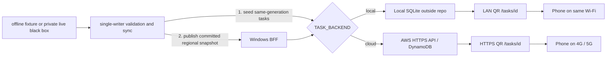

# NTPC YouBike Smart Dispatch Demo

以歷史站點資料、指定期間快照與天氣特徵呈現區域供需變化，產生調度優先級、派工任務與現場交接流程。公開 repo 提供可在本機執行的前端、same-origin BFF、SQLite 任務簿、QR 交接、資料合約、AWS Bedrock 說明 adapter 與測試；AWS 任務後端及 Google Sheets 鏡像仍須另行部署驗證。私有調度演算法透過本機黑箱 API 接入，不包含在此 repo。

本專案是獨立展示原型，不是新北市政府或 YouBike 官方服務；派工內容與操作情境僅供展示及驗證。

## 功能

- 顯示 29 個行政區的優先級、行動建議與經欄位縮減、區間化處理的摘要
- 從黑箱結果建立公開票單
- 手機頁面依序執行「接單 → 確認抵達 → 完成任務」；每一步各自留下冪等事件，未抵達不能將 `OPEN` 原子更新為 `COMPLETED`；五分鐘內未接單的任務由伺服器標為 `EXPIRED`
- 本機模式以 SQLite 保存事件；AWS 任務 API 是待部署驗證的另一個儲存後端，兩者明確分離
- 黑箱失效時 fail-closed；背景單一寫入同步先建立同代任務，再發布同代區域快照，瀏覽器讀取不觸發黑箱或任務寫入
- 明確離線模式可展示經欄位縮減、區間化與時間位移處理的 29 區固定資料
- 公開備查頁分開呈現 2026 年 1 至 9 月期間角色、近期批次與天氣特徵
- Bedrock 只解釋經敏感欄位遮蔽的行政區摘要，不參與派工判斷

公開與私有邊界見 [ARCHITECTURE.md](ARCHITECTURE.md)、[PAGE_AND_WORKSPACE_INDEX.md](PAGE_AND_WORKSPACE_INDEX.md) 與 [SECURITY.md](SECURITY.md)。

## 派工與證據層

- 機車是快速先遣：先確認站點現況、滯留或待回補車輛、可操作空間與交接條件，不負責載運自行車。
- 貨車是實際調度：確認需要補車或拔車後，才在合適時段搬運多輛自行車。
- 兩種任務共用同一張 QR 派工單與狀態紀錄，保留接單、抵達、完成事件與拒絕驗證紀錄。
- 歷史快照建立區域基準，近期流入快照提取偏移，再產生動態區域調度。
- 展示情境包含天氣、長假、觀光區及學區寒暑假週期的周轉變化，用於說明預備車、先遣確認與離峰順向發配。
- 都市更新與新站快速增加會改變生活圈，因此新站先通過站點母體更新閥門，再重算區域平衡。
- 河川、橋梁與幹道會割裂直線距離上的鄰近站點，派工優先在同側生活圈內平衡。
- 景安站案例比較電輔車配置與離峰調度，作為長期轉乘壓力的兩種展示方案。

上述內容是由私有證據包整理出的非重建式摘要；公開 repo 不含原始資料，因此不能單獨重算來源統計或因果關係。公開端只呈現趨勢、狀態級別與行動方向，不公開精確權重。

## 資料口徑

- 歷史快照摘要：公開資料來源涵蓋 2026 年 1 至 6 月；7 月至 9 月為專案本機保存資料，來源分層及交界日期保留在私有證據包。
- 指定觀察期間摘要：2026-09-08 至 2026-09-11，共 313 批、500,824 筆快照列、1,606 站點維度；數字只描述該批私有證據，不是公開 repo 可獨立重算的資料集。

- 天氣特徵：作為歷史與近期狀態比較，不冒充逐站即時觀測值。
- 近即時連線：由私有黑箱提供封裝結果，且必須通過來源時間、新鮮度與契約檢查。
- 離線展示：使用經欄位縮減、區間化與時間位移處理的 29 區固定資料，只驗證操作流程，不代表近期資料或演算法現算結果。

「29 區涵蓋」是歷史資料期間與行政區範圍，不代表首頁會同時列出 29 筆任務。首頁的區域數字是當次封裝結果選出的重點區。

## Windows 比賽執行

Repository 根目錄的 `INSTALL_AND_RUN_WINDOWS.cmd` 在 <code>%LOCALAPPDATA%\NTPCYouBikeVenue</code> 建立 Python runtime。有 `wheelhouse` 時採離線安裝，沒有時從 `requirements.txt` 安裝。啟動模式決定結果來源，`TASK_BACKEND` 決定任務儲存位置；兩者分開設定。

**本機／會場模式**：手機與電腦使用同一個 Wi-Fi，首次執行：

```cmd
INSTALL_AND_RUN_WINDOWS.cmd offline
```

啟動器會找出 Windows 可用的 IPv4，排除 loopback、APIPA 與未就緒位址。只有一個候選時才自動採用；找不到或有多個網卡時顯示候選並停止，請選定手機可達的位址再傳入 `[LAN-IP]`。不會自動產生指向手機 localhost 的 QR。已設定的 `PUBLIC_TASK_BASE_URL` 優先保留，其次是明確傳入的 LAN-IP 或既有 `PUBLIC_HOST`。

```cmd
public_shell\start_windows.cmd offline [LAN-IP]
```

`[LAN-IP]` 必須換成展示電腦實際位址。首次安裝也可傳入相同第二個參數。runtime 產生的 QR 指向 `http://[LAN-IP]:8084/tasks/{task_id}`；手機必須在相同網路且 Windows 防火牆允許 TCP 8084。VPN／虛擬網卡造成多個候選時，需要明確選擇，不猜測路由。本機 LAN HTTP 使用伺服器簽發且綁定任務的短效 grant 完成任務；這是本機示範授權，不是硬體身分驗證。

**AWS 雲端任務模式**：先由負責部署的人提供真實 HTTPS URL，再於同一個 Windows CMD 設定：

```cmd
set "TASK_BACKEND=cloud"
set "PUBLIC_TASK_BASE_URL=https://example.execute-api.us-west-2.amazonaws.com/demo"
set "YOUBIKE_AWS_PROFILE=your-aws-profile"
set "YOUBIKE_AWS_REGION=us-west-2"
INSTALL_AND_RUN_WINDOWS.cmd offline
```

上述網域是佔位範例，必須替換；URL 可保留 API Gateway stage 前綴。雲端模式的 QR 指向 AWS HTTPS `/tasks/{task_id}`，手機可透過 4G／5G 存取，不依賴展示電腦 LAN。`TASK_CLOUD_API_URL` 可另設 AWS API base，未設定則沿用 `PUBLIC_TASK_BASE_URL`。BFF 必須明確收到合法的 `YOUBIKE_AWS_PROFILE`；profile 名稱只用來選擇 AWS CLI 身分，不能取代 IAM 最小權限與資源範圍驗證。公開設定範本 [PUBLIC_RUNTIME_CONFIG.example.cmd](PUBLIC_RUNTIME_CONFIG.example.cmd) 只列非秘密選項，不包含金鑰或 session，也不會自動載入。

雲端模式不建立本機 SQLite 任務庫；AWS 不可用時回報失敗，不切回本機任務成功。離線固定資料仍只能標示為非即時，即使任務寫入雲端也不能改稱近即時。真實黑箱結果需要私有會場包與短效憑證，改以 `live` 啟動；沒有黑箱、憑證或來源新鮮度證據時直接停止或顯示服務中斷。



圖中的雲端連線需部署與驗證後才能視為可用；程式契約與本機測試不代表目標 Windows 展示機、手機或 AWS 實測完成。

## 本機測試

    python -m venv /tmp/ntpc-youbike-demo-venv
    /tmp/ntpc-youbike-demo-venv/bin/python -m pip install -r requirements.txt
    /tmp/ntpc-youbike-demo-venv/bin/python -m unittest discover -s tests -v

Windows：

    public_shell\smoke_windows.cmd

## 驗證與可重現性（加分項）

驗證方式與重現步驟見 [TEST_EVIDENCE.md](TEST_EVIDENCE.md)，兩種模式分開記錄：

- `OFFLINE_FIXTURE`（離線固定資料）：使用固定展示資料驗證操作流程，不代表即時結果。
- `LIVE_LOCAL_SANDBOX`（本機 LIVE 黑箱）：驗證本機黑箱連線與操作流程；結果僅適用於本機，不代表 AWS 雲端驗收完成。

## Bedrock 說明層

預設只產生請求檔，不呼叫付費服務：

    python public_shell\bedrock_explainer_adapter.py ^
      --payload fixtures\bedrock_summary_v1.json ^
      --output-dir %LOCALAPPDATA%\NTPCYouBikeVenue\bedrock ^
      --session-dir %LOCALAPPDATA%\NTPCYouBikeVenue\aws ^
      --profile your-aws-profile

只有操作員加上 <code>--allow-paid-inference</code> 才會呼叫一次 Amazon Bedrock Converse。Adapter 要求明確且格式合法的 AWS profile，拒絕環境中的長效 AWS 金鑰與其他模型供應商金鑰，並把 session 與輸出寫在 repository 外部。

## 公開限制

此 repo 不含原始站點快照、座標、歷史資料庫、觀察窗、特徵工程、乖離計算、權重、閾值、排序公式、私有 binary、憑證、AWS session、裝置韌體或執行日誌。公開程式只接受契約化結果，不公開足以直接重建核心運算的精確參數與中間值。

## 任務完成與雲端驗證邊界

本機任務使用短效簽章（300 秒）、任務別、事件時間與每次授權的匿名短期加鹽雜湊。流程依序為掃碼、接單、確認抵達、完成；未接單不能抵達，未抵達不能完成。五分鐘內未接單的任務由伺服器權威時間標為 `EXPIRED`，接單後不再自動失效。異常事件只寫稽核事件，不推進 `accepted_at`、`arrived_at` 或完成狀態。相同已提交事件重送會回傳相同成功結果，不重複更新；取消確認不送事件，驗證失敗只追加拒絕紀錄。簽章放在網址 fragment，不寫入存取日誌。瀏覽器不保存原始裝置識別資訊。

LIVE 來源快照的允許期限為 30 分鐘；背景同步若連續 90 秒沒有完成一次合法抓取、任務寫入與 committed snapshot 發布，公開結果即 fail-closed。兩個期限用途不同：30 分鐘檢查資料來源新鮮度，90 秒檢查同步路徑是否仍在運作。

本機簽章是公開示範能力，不能當作正式雲端操作者授權。服務重啟會使舊 QR 失效，請重新開啟任務頁產生 QR。接單、抵達時間與任務完成狀態保留在 SQLite。Schema v3 任務庫不會在啟動時自動修改；停止服務後，必須明確指定來源與全新備份位置執行 `python public_shell/task_ledger.py migrate-v3-to-v4 --database [DB_PATH] --backup [BACKUP_PATH]`。遷移先建立並驗證 v3 備份，再加入 nullable `arrived_at` 並升級為 v4；既有已完成任務不會被偽造抵達時間。

本機 LAN HTTP 可使用簽章內綁定的每次授權匿名值完成任務，前端不依賴 `crypto.subtle`。匿名值不是裝置指紋；簽章過期或驗證失敗時不改變狀態。手機 4G/5G 的固定 HTTPS QR 使用 `PUBLIC_TASK_BASE_URL` 指向部署後的 AWS URL；完成部署與實測前仍不可標成可用。

AWS API Gateway、Lambda、DynamoDB 與 Google Sheets 鏡像目前是待部署架構。本機頁面顯示「本機帳本」成功不代表 AWS 已更新；雲端模式不建立 SQLite，也不將 API 錯誤降級成本機成功。Windows CI、目標 Windows 展示機、手機行動網路與 Bedrock 真實呼叫應各自保留驗證結果。
