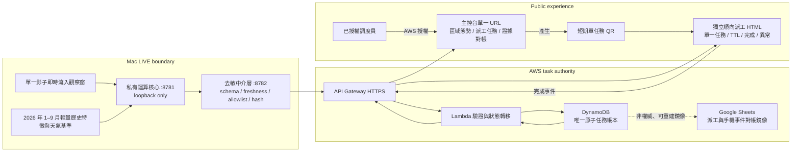

# NTPC YouBike Smart Dispatch LIVE System

以 2026 年 1 至 9 月歷史站點特徵、天氣基準與單一影子即時流入觀察窗，提取區域供需變化，產生新北 YouBike 調度優先級、派工任務與手機完成事件。歷史特徵的官方開放資料涵蓋 1 至 6 月，7 月起為本專案自有管線收集，兩者分層保存（見下方資料來源）。

本 repository 公開前端、任務工作區、QR 流程、BFF、資料契約、AWS 轉接契約與測試。AWS 轉接契約尚未部署，也尚未接上任何執行路徑。動態權重、特徵矩陣、評分公式及核心聚合方法保留在私有 `8781` 黑箱；公開端只接收經 `8782` 去敏中介層驗證與重建的安全結果。

本系統不是新北市政府或 YouBike 官方服務，公開畫面與派工流程用於競賽驗證。

## Current LIVE Critical Path



資料與狀態邊界：

- 前端不讀取大型原始 SQLite、逐站歷史列、私有觀察窗檔案或核心中間值。
- `8781` 只在 Mac loopback 提供私有運算結果，不直接對前端或 AWS 公開。
- `8782` 是黑箱與公開系統之間的唯一去敏中介，執行 schema、新鮮度、欄位白名單與完整性驗證。
- 主控台只有一個 URL，內含「區域態勢、派工任務、證據對帳」三個分頁；AWS 必須驗證調度員權限，僅隱藏按鈕不算授權。
- 主控台只能為一張已存在的任務產生短期、單任務 QR，不得產生可列舉任務池的共用憑證。
- 手機只開啟獨立的「順向派工 HTML」，顯示該任務的區域、行動、順向路線／站點順序、TTL、完成與異常操作。
- 手機頁不得連回主控台、開啟其他任務、列舉任務池，或顯示黑箱、AWS 帳號、資源名稱及內部錯誤資訊。
- DynamoDB 是任務狀態唯一原子權威；Google Sheets 只接收可重建的派工單、手機完成事件與對帳狀態。
- Sheets 寫入失敗不得回寫或推翻 DynamoDB 狀態，也不得被前端解讀為任務完成失敗。
- Current LIVE 路徑不以固定資料或舊 publication 代替即時來源；任一閘門失敗即 fail-closed。

## 功能

- 調度員以單一主控台 URL 切換區域態勢、派工任務與證據對帳三個分頁。
- 顯示 29 個行政區的狀態級別、行動方向、資料產生時間與新鮮度。
- 將安全化區域結果轉成派工任務，區分機車先遣確認與貨車實際搬運。
- 為單一任務產生短期 HTTPS QR，讓手機使用獨立網路開啟順向派工頁並提交完成或異常事件。
- 驗證任務狀態轉移、冪等事件、過期條件及重複操作。
- 以 DynamoDB 條件式寫入維持任務狀態一致性。
- 將 DynamoDB 已確認事件同步至 Google Sheets，供隊友與工作人員觀察及對帳。
- Bedrock 只把安全化的區域摘要改寫成現場作業說明，不參與優先級或派工決策。

## 資料口徑

- 歷史基準：2026 年 1 至 9 月的輕量特徵快照與天氣特徵，用於建立區域週期基準。來源分為兩層，不可混為一談：
  - **官方開放資料**涵蓋 2026-01-01 至 **2026-06-30**，當期站點母體為 1,586 站。
  - **2026-07-01 之後為本專案自有管線持續收集**，站點母體為 1,606 站。
  - 兩層在私有歷史庫中以 `source_layer` 分開保存，重疊期間去重後保留單一語意；公開端只使用其衍生的輕量特徵，不公開原始資料列。
- LIVE 來源：單一影子觀察窗持續接收近期站點與天氣流入，再與歷史基準比較。
- 公開輸出：區域、狀態級別、建議行動、產生時間、來源時間、任務識別與狀態。
- 私有內容：精確分數、權重、閾值、特徵矩陣、公式、逐站原始列、精確座標與核心運算中間值。
- 公開端維持相同資料契約、優先級方向與派工流程；敏感絕對值經安全轉換，因此不宣稱逐筆數值與私有端完全相同。

「29 區涵蓋」代表資料母體與區域狀態覆蓋，不代表每一輪都必須產生 29 張派工單。

## 派工依據

- 歷史基準與近期流入特徵發生偏移時，系統調整區域優先級與任務類型。
- 機車用於快速確認站點現況、滯留車、可操作空間及交接條件，不搬運自行車。
- 貨車用於已確認的補車或拔車任務，在合適時段執行實體調度。
- 天氣、長假、觀光區及學區寒暑假週期可改變借還時間與周轉型態，因此使用相符的時間基準比較。
- 新站快速增加會改變生活圈；站點母體更新後才重新計算區域平衡。
- 河川、橋梁與幹道可能割裂直線距離上的鄰近站點，優先在同側生活圈內平衡。

以上是公開的決策方向與營運情境，不公開私有評分公式或精確權重。

## Current 驗收狀態

| Gate | 狀態 | 可主張範圍 |
| --- | --- | --- |
| 單一影子 LIVE 流入 | 已有本機觀察證據 | 來源、站點與天氣持續更新；每次發布仍須通過新鮮度檢查 |
| 私有 `8781` | 已有本機 smoke | loopback 私有運算服務可回應 |
| 去敏 `8782` | 已有本機 smoke 與契約測試 | 可拒絕逾期、非 LIVE、額外敏感欄位與 hash 不一致 |
| 公開前端與任務流程 | 已有本機回歸 | 不代表 AWS 已部署 |
| API Gateway / Lambda / DynamoDB | **尚未完成正式部署驗收** | 不得標示雲端任務池已可用 |
| Google Sheets 對帳鏡像 | **尚未完成正式接線驗收** | Sheet 目前不得視為任務權威 |
| 手機 4G/5G QR 完成事件 | **尚未完成跨網路驗收** | 本機或區網結果不得代替此項 |
| Bedrock 真實呼叫 | **尚未完成正式驗收** | 不影響核心派工決策 |

詳細證據與限制見 [TEST_EVIDENCE.md](TEST_EVIDENCE.md)。

## 啟動 LIVE 系統

前置：去敏中介層必須已在 `127.0.0.1:8782` 回應健康檢查。該服務屬於私有專案，不在本 repository 內；公開端只是它的消費者。

呼叫中介層用的憑證必須放在 repository 之外、權限 owner-only，並以環境變數指向：

```bash
YOUBIKE_BLACKBOX_CREDENTIAL_FILE=<憑證檔絕對路徑> PYTHON_BIN=.venv/bin/python ./RUN_LIVE_MAC.sh
```

`PYTHON_BIN` 需指向同時具備 `jsonschema` 與 `qrcode` 的 Python 3.11 以上直譯器；系統預設 `python3` 未必符合，缺套件時腳本會直接拒絕啟動。

手機掃 QR 時，網址不能是 `127.0.0.1`，必須開放到區網：

```bash
YOUBIKE_PUBLIC_BIND=0.0.0.0 PUBLIC_TASK_BASE_URL=http://<本機區網位址>:8084 YOUBIKE_BLACKBOX_CREDENTIAL_FILE=<憑證檔絕對路徑> PYTHON_BIN=.venv/bin/python ./RUN_LIVE_MAC.sh
```

未指定 `PUBLIC_TASK_BASE_URL` 時腳本會自行偵測區網位址；偵測到多於一個時拒絕啟動並列出候選，以避免 QR 編到錯誤網段。

腳本在啟動前先確認中介層健康，啟動後執行 smoke：公開健康檢查、LIVE 結果新鮮度與去敏欄位掃描、任務清單。任一項失敗即中止並回報原因，不會以 fixture 或過期結果頂替。

## 本機公開程式回歸

```bash
python -m venv /tmp/ntpc-youbike-live-venv
/tmp/ntpc-youbike-live-venv/bin/python -m pip install -r requirements.txt
/tmp/ntpc-youbike-live-venv/bin/python -m unittest discover -s tests -v
```

回歸測試只驗證公開程式與契約，不等同 AWS、Google Sheets 或手機跨網路驗收。

## Bedrock 說明層

Bedrock 只能接收經 `8782` 核准的行政區摘要、狀態級別、行動標籤與小型統計。它不接收逐站資料、座標、原始天氣列、分數、權重或公式，也不能建立或修改派工決策。

## 公開限制

此 repository 不含原始站點歷史資料庫、私有觀察窗狀態、精確座標、核心特徵工程、動態權重、閾值、排序公式、私有 binary、憑證、AWS session 或執行日誌。公開程式只接受契約化安全結果。

公開與私有邊界詳見 [ARCHITECTURE.md](ARCHITECTURE.md)、[PAGE_AND_WORKSPACE_INDEX.md](PAGE_AND_WORKSPACE_INDEX.md) 與 [SECURITY.md](SECURITY.md)。

## 交件範圍

Current 交件由三部分組成：

1. 可操作的 LIVE 系統與公開 GitHub 原始碼。
2. 說明問題、證據、架構、AWS 使用方式與 Live 操作的競賽簡報。
3. 說明資料應用、技術架構、生成式 AI 使用邊界與驗收結果的提案書。
