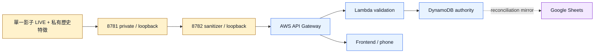

# Security And Publication Boundary

## Public Surface

- 前端調度工作區、任務池、QR 與手機任務頁。
- Same-origin BFF、公開 request/response/task schema 與 AWS 接線程式。
- 1–9 月期間的輕量區域特徵、天氣基準及不可反推的證據圖。
- 任務狀態、事件結果與 Google Sheets 對帳欄位設計。
- Bedrock 安全摘要契約、測試與公開驗證說明。

## Private Surface

- `8781` 核心演算法、動態權重、閾值、特徵矩陣、公式及精確分數。
- 原始站點快照、逐站歷史列、座標、地址、站點識別及大型歷史 SQLite。
- 影子觀察窗內部狀態、私有 runtime logs、檔案路徑與來源憑證。
- `8781` / `8782` bearer credentials、AWS session、Token 與 private binary。
- 可用來重建核心運算的精確中間值或高頻連續序列。

## Enforced LIVE Boundary

前端與手機不得直接呼叫 `8781` 或 `8782`。`8782` 只能向已驗證的 AWS API 發布安全 payload；所有未列入 allowlist 的欄位都必須拒絕。

## Controls

- `8781` 與 `8782` 綁定 loopback；不對 LAN 或 Internet 開放。
- 8781→8782 及 8782→AWS 使用不同的短效憑證與明確 audience，不共用管理憑證。
- HTTP client 拒絕 redirect，防止 credential 被轉送到未核准端點。
- 8782 驗證 schema、來源與結果時間、freshness、hash、枚舉、型別、巢狀 allowlist 及 denied keys。
- Current LIVE 路徑 fail-closed；來源逾期、黑箱失聯、契約不符、hash 不符或 AWS 拒絕時，不得顯示新一輪成功。
- 前端不直接讀取大型原始 DB，只能取得區域級安全摘要與任務資料。
- DynamoDB 使用條件式寫入、idempotency key 與合法狀態轉移，作為唯一任務權威。
- Google Sheets 是 DynamoDB 提交後的可重試鏡像；Sheet 寫入失敗不得回滾或覆蓋 DynamoDB。
- 手機端不持有 AWS 管理憑證；QR 只包含任務網址與短效、最小權限授權資訊。
- 不保存原始裝置指紋；如需防重，只保存短期加鹽雜湊與最小稽核 metadata。
- Bedrock payload 必須拒絕站點、座標、身份、演算法、精確分數與秘密欄位。
- Runtime DB、logs、AWS credential/session、環境檔與私有資料路徑不得加入 Git。

## DynamoDB And Sheets Boundary

1. Lambda 驗證成功並完成 DynamoDB 原子提交後，才回應任務成功。
2. Sheets 同步使用 task ID、event ID、publication ID 與 DynamoDB version 進行對帳。
3. 重複 Sheets 寫入必須冪等；禁止以列號作唯一業務識別。
4. Sheets 不一致時標記 `待對帳`，不能自行把任務改成完成或未完成。
5. 對帳程序只能從 DynamoDB 單向重建 Sheet；任何反向同步必須是另一個經審核的管理流程，Current 不啟用。

## AWS Boundary

- AWS CLI 必須使用明確命名的短效 profile；profile 名稱只是身分選擇器，不是授權證明。
- 部署前需驗證 account、role、region、session expiry、IAM least privilege 與 resource scope。
- API Gateway、Lambda、DynamoDB、Sheets mirror 與 Bedrock 必須分開保留部署及驗收證據。
- AWS 或 Sheets 尚未驗收時，文件與畫面不得標示雲端主線已完成。

## Reporting

不要在 public issue、commit、README、Sheet 或簡報中放入秘密、原始個資、AWS session、Token、私有路徑、完整錯誤堆疊或可重建演算法的資料。安全問題應以最小可重現 metadata 私下回報 repository owner。

## Frozen History

Windows、USB 與 venue kit 資產只保留歷史追溯用途，狀態為 `FROZEN`。不得將其中的舊設定、資料包或驗收結果視為 Current LIVE 安全邊界。
